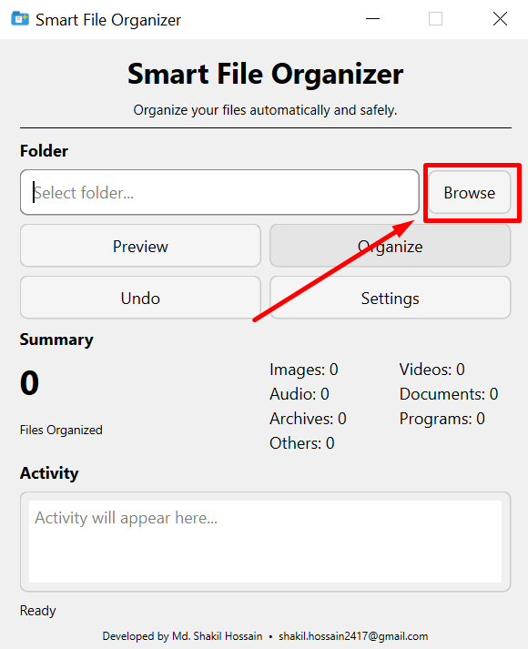
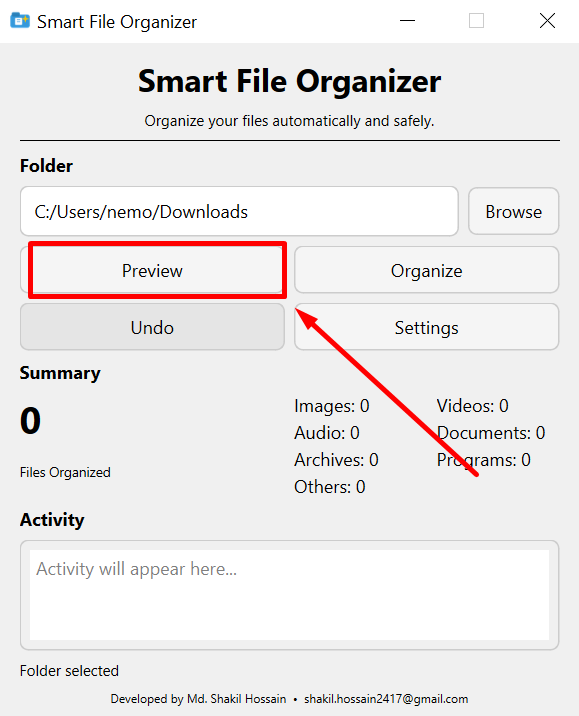
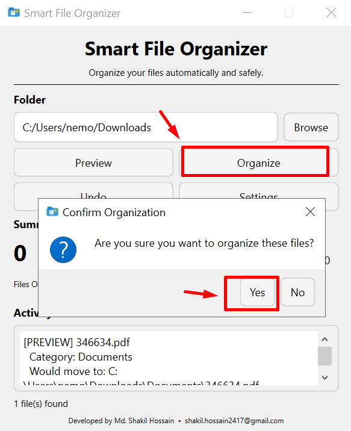
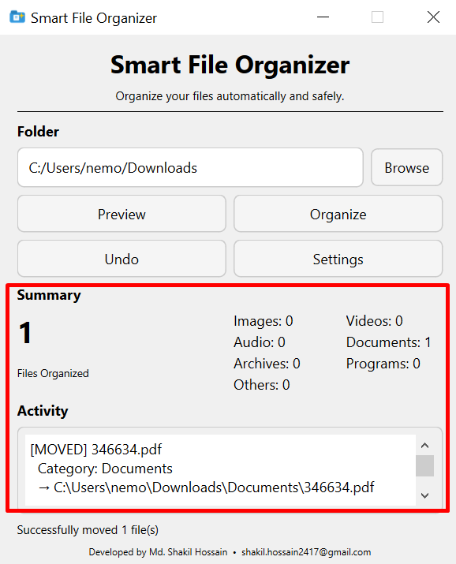

# Smart File Organizer

A simple and safe desktop application that automatically organizes files into categories such as Images, Documents, Videos, Archives, Programs, and Others.

## Features

- 📁 Select any folder
- 🔍 Preview files before organizing
- 📂 Automatically categorize files
- 🔄 Undo the last organization
- ⚙️ Customize file extensions
- 📊 Organization summary
- 🖥️ Clean desktop GUI
- 🛡️ Duplicate filenames are handled safely
- 🚫 Unknown file types go to Others
- ⚡ Lightweight and fast

## Categories

| Category | Examples |
|---|---|
| Images | JPG, PNG, GIF, WEBP |
| Videos | MP4, MKV, AVI, MOV |
| Audio | MP3, WAV, FLAC |
| Documents | PDF, DOCX, PPTX, TXT |
| Archives | ZIP, RAR, 7Z, TAR |
| Programs | EXE, MSI |
| Others | Unknown file types |

## Screenshots

### Browse Folder


### Preview Selected Folder


### Click organize and Confirm


### Summary Box


## Requirements

- Windows
- Python 3.14+
- PySide6

## Installation

Clone the repository:

```bash
git clone YOUR_GITHUB_REPOSITORY_URL
cd smart-file-organizer
```

Create a virtual environment:

```powershell
python -m venv .venv
```

Activate it:

```powershell
.\.venv\Scripts\Activate.ps1
```

Install dependencies:

```powershell
pip install -r requirements.txt
```

Run the application:

```powershell
python app.py
```

## How It Works

1. Select a folder.
2. Click Preview to see what will happen.
3. Review the proposed organization.
4. Click Organize.
5. Files are moved into category folders.
6. Use Undo to restore the last organization.

## Project Structure

```text
smart-file-organizer/
│
├── app.py
├── organizer.py
├── categories.json
├── requirements.txt
├── README.md
├── .gitignore
└── backups/
```

## Safety

The application does not delete files.

Files are moved into category folders, and duplicate filenames are automatically renamed instead of being overwritten.

Always review the Preview before organizing important folders.

## Developer

**Md. Shakil Hossain**

Email: shakil.hossain2417@gmail.com

## License

This project is open source and available for personal and educational use.
